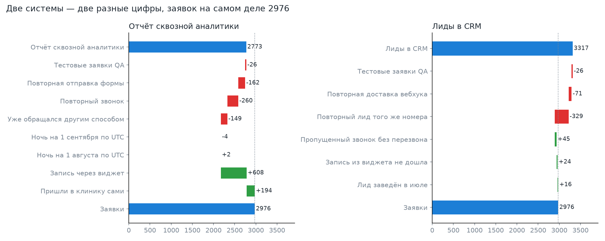
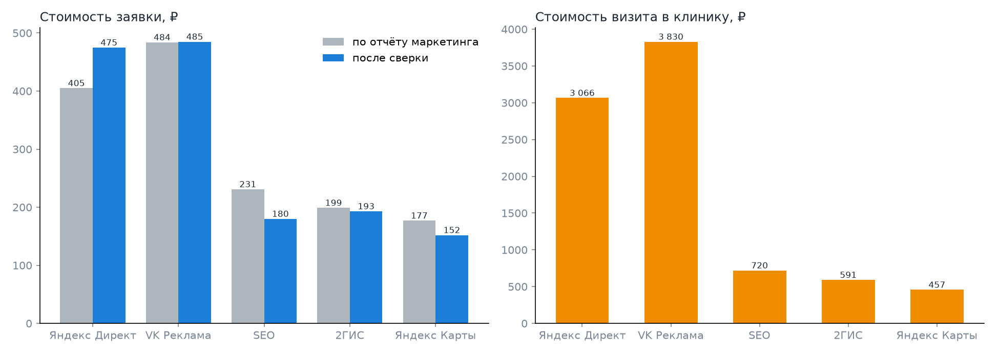
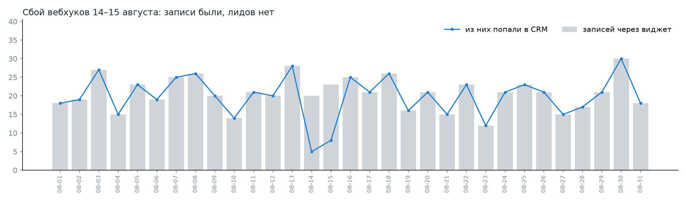

# Сверка заявок из трёх источников

[](https://github.com/doomsdayoff/leads-reconciliation/actions/workflows/tests.yml)

Кейс анализа данных для сети стоматологических клиник. Данные синтетические: генератор
воспроизводит типичные дефекты сбора заявок, а тесты проверяют, что анализ находит их
ровно в том объёме, в каком они заложены.

**Вопрос.** За август отчёт сквозной аналитики показал 2 773 заявки, CRM — 3 317, сервис
онлайн-записи — 643 записи через виджет. Маркетинг и продажи спорят, чья цифра верная,
а распределение рекламного бюджета опирается на стоимость заявки из отчёта маркетинга.
Сколько заявок было на самом деле и можно ли верить стоимости заявки по каналам?

## Коротко

- **Заявок было 2 976.** Отчёт маркетинга занижал их на 7%, CRM завышала на 11%.
- **Маркетинг** не видит записей через виджет (+608) и тех, кто пришёл в клинику сам (+194),
  зато считает каждую повторную форму и каждый повторный звонок (−571).
- **CRM** раздута повторными лидами того же номера (−329) и повторной доставкой вебхуков (−71),
  а 45 обратившихся в неё не попали вовсе: пропущенный звонок, никто не перезвонил.
- **Яндекс Директ** по отчёту стоил 405 ₽ за заявку, на деле — 475 ₽ (+17%): 140 из 162 повторных
  отправок формы пришлись на его посадочную. По стоимости визита в клинику Директ (3 066 ₽)
  и VK (3 830 ₽) в 5–8 раз дороже Яндекс Карт и 2ГИС (457–591 ₽).
- **14–15 августа** вебхуки из виджета записи полтора дня не доходили до CRM: 30 записей
  без лида, 24 человека не оставили в CRM никакого следа. Мониторинга доставки нет.



## Что считаем заявкой

Спор «чья цифра верная» начинается с того, что системы считают разное: сквозная аналитика —
события, CRM — записи, а бизнесу нужны люди. Поэтому сначала определение:

> **Заявка** — номер телефона, с которого хотя бы раз обратились в августе по московскому
> времени: форма на сайте, звонок, запись через виджет или визит без предварительного обращения.
> Тестовые номера QA не считаются. **Канал заявки** — канал первого обращения в месяце.

Номер телефона выбран ключом человека, потому что он есть во всех трёх системах.
Цена такого выбора описана в [ограничениях](#ограничения).

## Данные

| Файл | Система | Время | Особенности |
|---|---|---|---|
| [`marketing_events.csv`](data/marketing_events.csv) | Сквозная аналитика: формы и звонки | UTC | Каждая отправка формы и каждый звонок — отдельная строка; канал по UTM |
| [`crm_leads.csv`](data/crm_leads.csv) | CRM | МСК | Лиды из форм и виджета приходят вебхуком, по звонкам заводятся вручную с меткой «откуда узнали» |
| [`booking_requests.csv`](data/booking_requests.csv) | Сервис онлайн-записи | UTC | Записи через виджет; в сквозную аналитику не попадают |
| [`ad_spend.csv`](data/ad_spend.csv) | Расходы по каналам | — | Август |
| [`utm_mapping.csv`](data/utm_mapping.csv), [`crm_source_mapping.csv`](data/crm_source_mapping.csv) | Справочники каналов | — | UTM → канал; 32 варианта ручной метки CRM → канал |

Телефоны записаны в семи форматах — от `+7 (912) 345-67-89` до `8(912)3456789`.
Данные создаёт [`generate_data.py`](generate_data.py); файл `data/_truth.json` с эталоном
анализ не читает, он нужен только тестам.

## Ход анализа

Анализ — SQL поверх SQLite, Python только загружает CSV и рисует графики.

1. **Нормализация** — [`01_staging.sql`](sql/01_staging.sql). Телефон → 11 цифр
   (разделители прочь, ведущая 8 → 7), UTC → Москва, UTM и ручные метки → каналы.
2. **Единый журнал обращений** — [`02_requests.sql`](sql/02_requests.sql). Три источника в одной
   таблице. Ручной лид CRM считается копией звонка, если с этого номера звонили за 3 часа до
   него; иначе это визит без обращения. Первое обращение номера в месяце (`ROW_NUMBER`) — заявка,
   остальные классифицируются через `LAG` и накопительную сумму звонков.
3. **Сверка каждого источника** — [`11`–`14`](sql). Каждая строка отчёта маркетинга и каждый лид
   CRM получает категорию: заявка, тест, повторная форма, повторный звонок, повторная доставка
   вебхука и т. д. Категории складываются в водопад, который обязан сойтись с числом заявок —
   это проверяет [`reconcile.py`](reconcile.py), иначе падает.
4. **Качество данных** — [`10_quality_checks.sql`](sql/10_quality_checks.sql).
5. **Каналы** — [`15_channels.sql`](sql/15_channels.sql): стоимость заявки по отчёту и после сверки,
   стоимость визита.

## Результаты

### Отчёт сквозной аналитики → заявки

| Шаг | Строк |
|---|---:|
| Отчёт за август (по UTC) | 2 773 |
| Тестовые заявки QA | −26 |
| Повторная отправка формы в течение 10 минут | −162 |
| Повторный звонок того же номера | −260 |
| Уже обращался другим способом | −149 |
| Ночь на 1 сентября: август по UTC, сентябрь по Москве | −4 |
| Ночь на 1 августа: июль по UTC, август по Москве | +2 |
| Записи через виджет — отчёт их не видит | +608 |
| Пришли в клинику сами | +194 |
| **Заявки** | **2 976** |

### CRM → заявки

| Шаг | Строк |
|---|---:|
| Лиды за август (по Москве) | 3 317 |
| Тестовые заявки QA | −26 |
| Повторная доставка вебхука (тот же `external_id`) | −71 |
| Повторный лид того же номера | −329 |
| Пропущенный звонок без перезвона — лида нет | +45 |
| Запись из виджета не дошла до CRM | +24 |
| Лид заведён в июле, в августе человек обратился снова | +16 |
| **Заявки** | **2 976** |

### Каналы

| Канал | Расход | В отчёте | Заявок | Визитов | Заявка по отчёту | Заявка после сверки | Визит |
|---|---:|---:|---:|---:|---:|---:|---:|
| Яндекс Директ | 420 000 ₽ | 1 037 | 885 | 137 | 405 ₽ | 475 ₽ | 3 066 ₽ |
| VK Реклама | 180 000 ₽ | 372 | 371 | 47 | 484 ₽ | 485 ₽ | 3 830 ₽ |
| SEO | 90 000 ₽ | 389 | 500 | 125 | 231 ₽ | 180 ₽ | 720 ₽ |
| 2ГИС | 65 000 ₽ | 326 | 336 | 110 | 199 ₽ | 193 ₽ | 591 ₽ |
| Яндекс Карты | 48 000 ₽ | 271 | 315 | 105 | 177 ₽ | 152 ₽ | 457 ₽ |
| Прямые и рекомендации | — | 352 | 375 | 159 | — | — | — |
| Пришли сами | — | — | 194 | 104 | — | — | — |

Ошибка отчёта маркетинга не одинакова по каналам: Директ он удешевлял (дубли форм на посадочной),
а SEO и карты — удорожал (не видел записей через виджет, а у этих каналов их доля самая высокая).



### Сбой доставки вебхуков



С 14 августа 09:07 до 15 августа 16:17 ни одна запись через виджет не превратилась в лид.
Разрыв виден только при сравнении двух систем по дням — внутри каждой из них всё выглядит нормально.

### Качество данных

| Проверка | Где | Найдено |
|---|---|---:|
| Телефон не приводится к 11 цифрам | все источники | 0 |
| Тестовые заявки QA | сквозная аналитика / CRM | 26 / 26 |
| Повторная доставка вебхука | CRM, вся выгрузка | 81 |
| Запись из виджета не дошла до CRM | сервис записи | 30 |
| Пропущенный звонок без перезвона за 3 часа | коллтрекинг, вся выгрузка | 62 |
| Ручная метка источника не из справочника | CRM | 232 из 1 694 |
| Метка в CRM расходится с коллтрекингом | CRM | 335 из 1 241 |
| Событие в разных месяцах по UTC и по Москве | сквозная аналитика | 6 |

Полные таблицы — в [`results/`](results).

## Выводы и что делать

1. **Одно определение заявки для маркетинга и продаж** и витрина на нём. Пока каждая сторона
   считает своё, спор о цифрах не закончится, а решения по бюджету принимаются по искажённой цене.
2. **Пересмотреть бюджет по стоимости визита, а не заявки.** Директ и VK дают визит за 3–4 тыс. ₽,
   карты и 2ГИС — за 0,5–0,6 тыс. ₽. Охват карт ограничен, поэтому перераспределение стоит
   проверить тестом на части бюджета, а не переносить целиком.
3. **Посадочная Директа:** блокировать кнопку после отправки. Каждая пятая форма в отчёте по
   Директу — повтор (140 из 668).
4. **Идемпотентный приём вебхуков в CRM** по `external_id` — убирает дубли от повторной доставки.
   Как это устроить, разобрано в кейсе
   [синхронизации записи с CRM](https://github.com/doomsdayoff/system-analysis-portfolio/tree/main/case-02-booking-crm-sync).
5. **Мониторинг доставки:** алерт, если записи через виджет есть, а лидов из них нет больше часа.
   Сбой 14–15 августа нашёлся бы в первый час, а не при ретроспективной сверке.
6. **Регламент перезвона на пропущенные.** 45 человек за месяц не попали в CRM совсем.
   Среди заявок, начавшихся со звонка, до визита доходят 29%: это около 13 визитов в месяц —
   примерно 260 000 ₽ при среднем чеке первого визита 20 000 ₽ (допущение, в данных чеков нет).
7. **Метка источника в CRM — выпадающим списком, атрибуцию звонков брать из коллтрекинга.**
   Сейчас у 27% ручных лидов метка расходится с коллтрекингом, у 14% её нет в справочнике.
8. **Отчёт сквозной аналитики — по московскому времени.** На месяц влияние мало (6 событий),
   но дневные и недельные отчёты сдвигаются на три часа.

## Проверка метода

Генератор знает, кто стоит за каждой строкой, и считает эталон по тем же определениям.
Анализ видит только «грязные» CSV. [Тесты](tests/test_reconciliation.py) сравнивают их поштучно:

- число заявок и распределение по каналам первого касания;
- каждую категорию водопада отчёта маркетинга и CRM;
- причины, по которым заявки нет в CRM, и число записей, потерянных при сбое;
- что все телефоны нормализуются, хотя пришли в разных форматах;
- что данные в репозитории совпадают с тем, что выдаёт генератор, — README не расходится с кодом.

Если ошибиться в нормализации телефона, часовом поясе или окне сопоставления лида со звонком,
числа разойдутся с эталоном и тесты упадут.

## Как запустить

```bash
pip install -r requirements.txt
python generate_data.py   # пересоздать data/ (необязательно, данные уже в репозитории)
python reconcile.py       # results/*.csv, results/summary.md, charts/*.png
python -m pytest -q
```

## Ограничения

- Данные синтетические: частоты дефектов заданы в генераторе, а не измерены. Кейс показывает
  метод и ход рассуждения; сюжет взят из реальной задачи — расхождения числа заявок между тремя
  системами.
- Человек = номер телефона: общий семейный номер склеивает двух людей, смена номера — разделяет одного.
- Сопоставление ручного лида со звонком — эвристика по окну в 3 часа.
- Справочник меток сопоставляется по точному написанию: SQLite не переводит кириллицу
  в нижний регистр, в PostgreSQL здесь был бы `lower()` и нечёткое сравнение.
- Визит определяется по статусу лида в CRM за август; визиты по июльским лидам не учтены.
